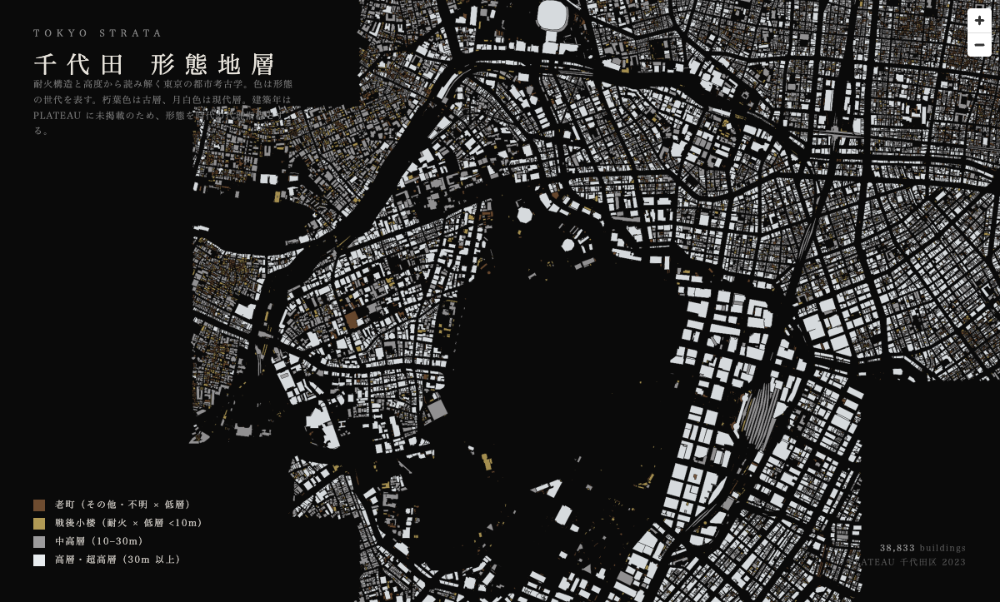

# tokyo-strata

PoC: visualize Tokyo's building strata as an editorial map (NHK-style city archaeology).

## Status

**2026-05-02**: Original direction (color by `yearOfConstruction`) **NO-GO** — PLATEAU Chiyoda 2023 has 0/38833 buildings with that attribute.

**Pivot A executed**: form strata using `measuredHeight × fireproofStructureType` (both 100% coverage). First render of Chiyoda below — Imperial Palace shows as the central void.



See [findings.md](./findings.md) for the full result, coverage stats, and color palette rationale.

## Data sources tested

- [PLATEAU 千代田区 2023 CityGML v4](https://www.geospatial.jp/ckan/dataset/plateau-13101-chiyoda-ku-2023) — 1.8 GB zip, 38833 buildings, `yearOfConstruction` not published

## Run

```bash
# 1) Coverage probe on any PLATEAU CityGML zip
./scripts/check-year-coverage.sh data/chiyoda-citygml.zip

# 2) Parse all bldg/*.gml → buildings.geojson
python3 scripts/parse_to_geojson.py

# 3) Serve the viewer
python3 -m http.server 9877
# open http://localhost:9877/
```

## Layout

```
index.html                  maplibre viewer (4-tier strata color)
data/                       gitignored — citygml zips, extracted gml, buildings.geojson
scripts/
  check-year-coverage.sh    yearOfConstruction probe
  parse_to_geojson.py       CityGML → GeoJSON (footprint + height + fireproof + usage)
screenshots/                rendered samples (committed)
findings.md                 PoC results log
```
