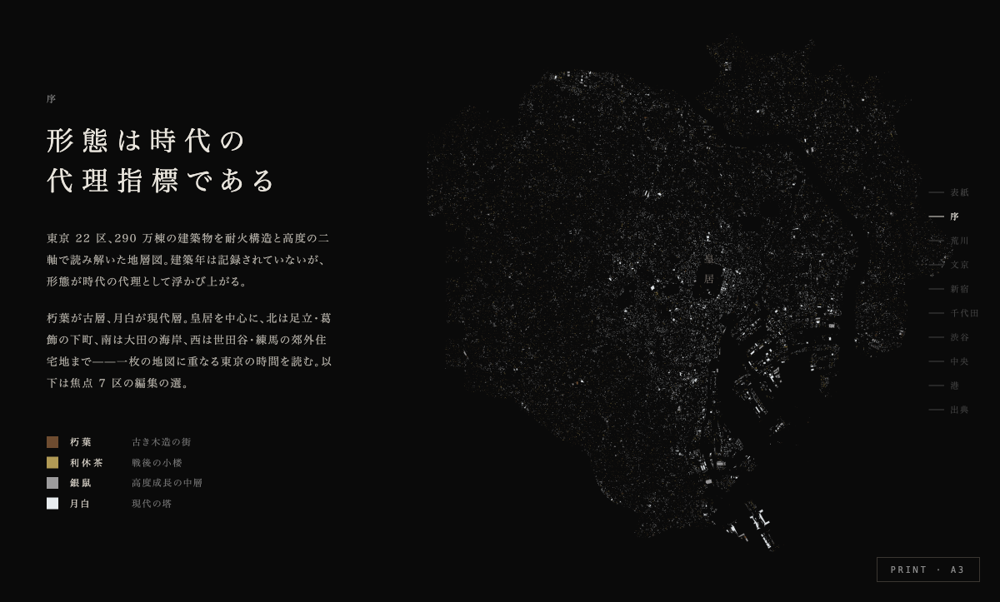
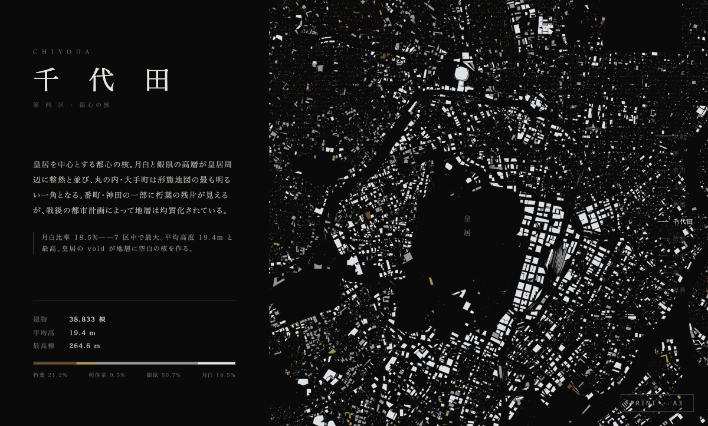
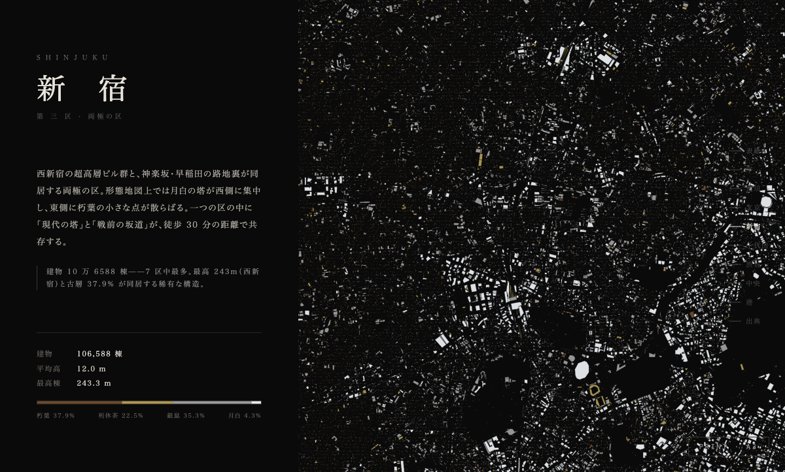

# tokyo-strata

**Live**: https://tokyo-strata.vercel.app

PoC: visualize Tokyo's building strata as an editorial map (NHK-style city archaeology).

## Status

**2026-05-02**: Original direction (color by `yearOfConstruction`) **NO-GO** — PLATEAU Chiyoda 2023 has 0/38833 buildings with that attribute.

**Pivot A executed**: form strata using `measuredHeight × fireproofStructureType` (both 100% coverage). **22 of 23 wards loaded (台東 has no PLATEAU 2023 dataset), 2,900,190 buildings, served via 48 MB PMTiles.**

**Editorial mode** (`index.html`): scrolling magazine — 表紙 → 序 → 焦点 7 区 → 出典. BRUTUS / NHK 出版社 city archaeology tone. PMTiles powers all maps.






**Explore mode** (`explore.html`): free zoom/pan over all 22 wards.

| Ward span | Buildings |
|---|---:|
| 千代田・中央・港・新宿・文京・墨田・江東・品川・目黒・大田・世田谷・渋谷・中野・杉並・豊島・北・荒川・板橋・練馬・足立・葛飾・江戸川 | 2,900,190 |

See [findings.md](./findings.md) for the full result, coverage stats, and color palette rationale.

## Data sources tested

- [PLATEAU 千代田区 2023 CityGML v4](https://www.geospatial.jp/ckan/dataset/plateau-13101-chiyoda-ku-2023) — 1.8 GB zip, 38833 buildings, `yearOfConstruction` not published

## Add a ward / rebuild tiles

```bash
# 1) Add a single ward (download + unzip + parse, optionally cleanup udx after)
./scripts/add-ward.sh <ward-id> <plateau-citygml-zip-url> cleanup

# 2) Or batch all 22 wards from scripts/all-wards.txt (skips wards already parsed)
while read ward url; do
  ./scripts/add-ward.sh "$ward" "$url" cleanup
done < scripts/all-wards.txt

# 3) Rebuild stats + tile (after adding/changing wards)
python3 scripts/compute_stats.py     # → data/stats.json
./scripts/build-tiles.sh             # → data/tokyo.pmtiles (~48 MB)

# 4) Redeploy
vercel --prod --yes
```

## Run viewer

```bash
python3 -m http.server 9877
# open http://localhost:9877/
```

## Layout

```
index.html                  editorial scrolling magazine (BRUTUS/NHK tone), PMTiles
explore.html                free interactive map, PMTiles
data/tokyo.pmtiles          48 MB vector tile (committed)
data/stats.json             per-ward count/bbox/strata%/avg-max height (committed)
data/<ward>/                gitignored intermediates — citygml + extracted gml + buildings.geojson
scripts/
  add-ward.sh               one-shot pipeline: download + unzip + parse (with cleanup)
  all-wards.txt             ward-id + URL list for batch processing
  parse_to_geojson.py       CityGML → GeoJSON (footprint + height + fireproof + usage)
  check-year-coverage.sh    yearOfConstruction probe (kept as reference; always 0% on PLATEAU)
  compute_stats.py          per-ward stats → data/stats.json
  merge_to_ndjson.py        per-ward GeoJSON → NDJSON for tippecanoe
  build-tiles.sh            merge → tippecanoe → pmtiles (full tile rebuild)
screenshots/                rendered samples (committed)
findings.md                 PoC results log
```

## Tile pipeline

```
22 PLATEAU CityGML zips (~30 GB total)
  ↓ unzip + parse (parse_to_geojson.py)
22 buildings.geojson (~1 GB total)
  ↓ merge_to_ndjson.py
all-buildings.ndjson (1.2 GB, 2.9M features)
  ↓ tippecanoe -Z9 -z14 --drop-densest-as-needed --simplification=8
tokyo.mbtiles (48 MB)
  ↓ pmtiles convert
tokyo.pmtiles (48 MB)
  ↓ vercel
https://tokyo-strata.vercel.app/data/tokyo.pmtiles (HTTP range requests)
```
