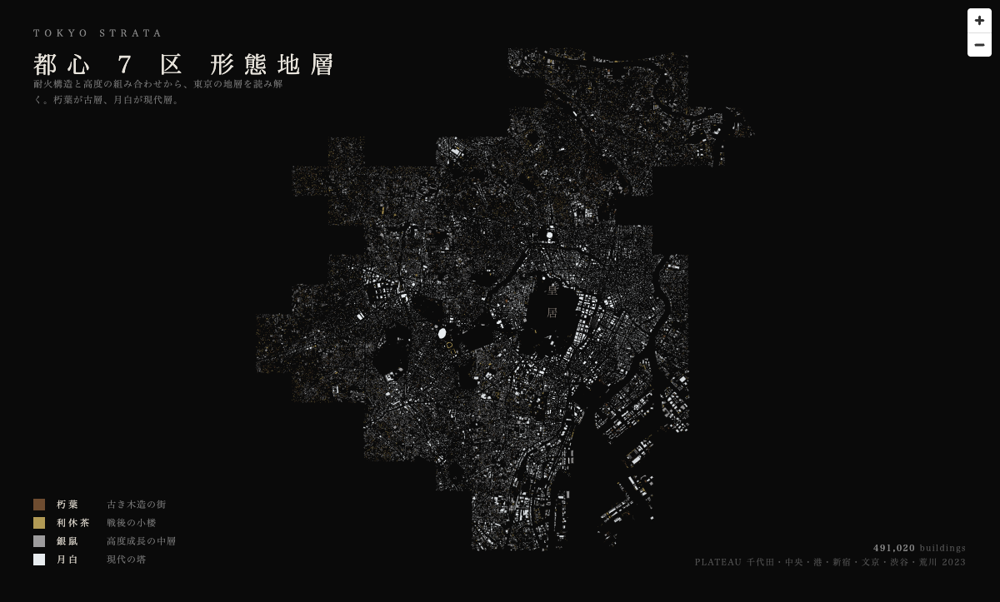

# tokyo-strata

PoC: visualize Tokyo's building strata as an editorial map (NHK-style city archaeology).

## Status

**2026-05-02**: Original direction (color by `yearOfConstruction`) **NO-GO** — PLATEAU Chiyoda 2023 has 0/38833 buildings with that attribute.

**Pivot A executed**: form strata using `measuredHeight × fireproofStructureType` (both 100% coverage). **7 wards loaded (都心圏), 491,020 buildings.**



| Ward | Buildings |
|---|---:|
| 千代田 / 中央 / 港 / 新宿 / 文京 / 渋谷 / 荒川 | 491,020 |

See [findings.md](./findings.md) for the full result, coverage stats, and color palette rationale.

## Data sources tested

- [PLATEAU 千代田区 2023 CityGML v4](https://www.geospatial.jp/ckan/dataset/plateau-13101-chiyoda-ku-2023) — 1.8 GB zip, 38833 buildings, `yearOfConstruction` not published

## Add a ward

```bash
./scripts/add-ward.sh <ward-id> <plateau-citygml-zip-url>
# then add { id: '<ward-id>', name: '<日本語>' } to REGIONS in index.html
```

The script does download + unzip (bldg + codelists only) + parse → `data/<ward-id>/buildings.geojson`. Idempotent; rerun is safe.

## Run viewer

```bash
python3 -m http.server 9877
# open http://localhost:9877/
```

## Layout

```
index.html                  maplibre viewer (4-tier strata color, multi-ward)
data/<ward>/                gitignored — per-ward citygml + extracted gml + buildings.geojson
scripts/
  check-year-coverage.sh    yearOfConstruction probe
  parse_to_geojson.py       CityGML → GeoJSON (footprint + height + fireproof + usage)
screenshots/                rendered samples (committed)
findings.md                 PoC results log
```
