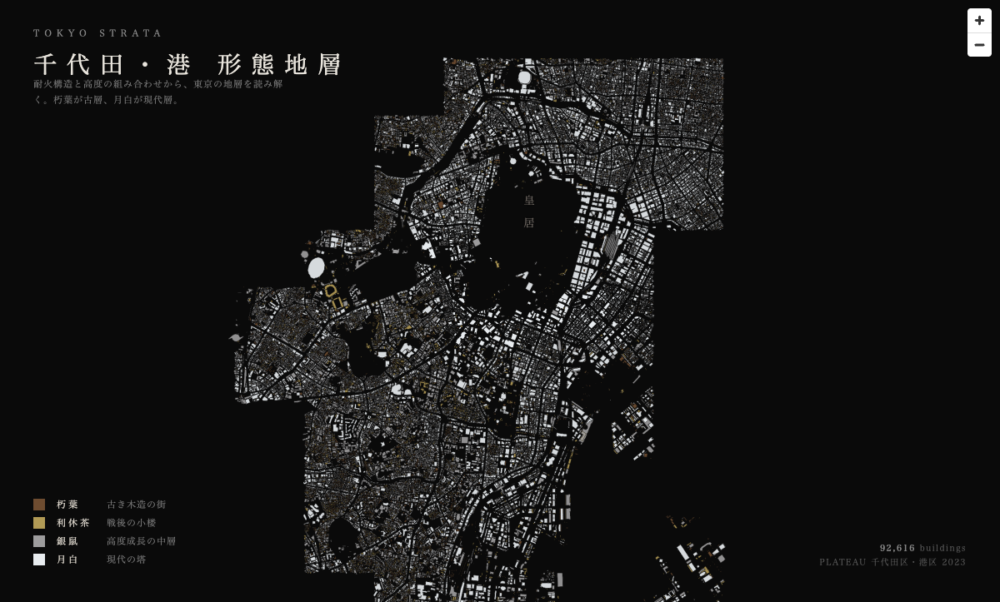

# tokyo-strata

PoC: visualize Tokyo's building strata as an editorial map (NHK-style city archaeology).

## Status

**2026-05-02**: Original direction (color by `yearOfConstruction`) **NO-GO** — PLATEAU Chiyoda 2023 has 0/38833 buildings with that attribute.

**Pivot A executed**: form strata using `measuredHeight × fireproofStructureType` (both 100% coverage). 2 wards loaded (千代田 + 港区), 92,616 buildings combined.



See [findings.md](./findings.md) for the full result, coverage stats, and color palette rationale.

## Data sources tested

- [PLATEAU 千代田区 2023 CityGML v4](https://www.geospatial.jp/ckan/dataset/plateau-13101-chiyoda-ku-2023) — 1.8 GB zip, 38833 buildings, `yearOfConstruction` not published

## Add a ward

```bash
WARD=shibuya  # or whatever
mkdir -p data/$WARD
curl -L -o data/$WARD/${WARD}-citygml.zip "<plateau ckan url>"
cd data/$WARD && unzip -oq ${WARD}-citygml.zip "udx/bldg/*" "codelists/*" && cd -

# Coverage probe (optional — confirms yearOfConstruction still 0%)
./scripts/check-year-coverage.sh data/$WARD/${WARD}-citygml.zip

# Parse → GeoJSON
python3 scripts/parse_to_geojson.py data/$WARD data/$WARD/buildings.geojson

# Add { id: 'shibuya', name: '渋谷区' } to REGIONS in index.html
```

## Run viewer

```bash
python3 -m http.server 9877
# open http://localhost:9877/
```

## Layout

```
index.html                  maplibre viewer (4-tier strata color, multi-ward)
data/<ward>/                gitignored — per-ward citygml + extracted gml + buildings.geojson
scripts/
  check-year-coverage.sh    yearOfConstruction probe
  parse_to_geojson.py       CityGML → GeoJSON (footprint + height + fireproof + usage)
screenshots/                rendered samples (committed)
findings.md                 PoC results log
```
